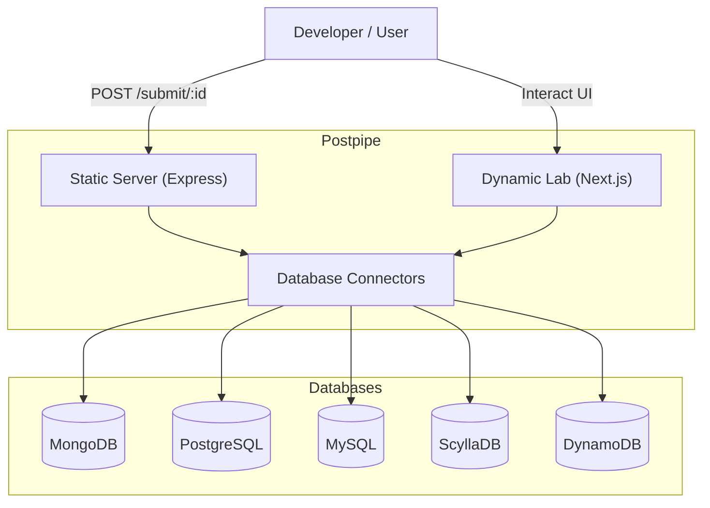

# Postpipe 2.0 Backend Lab

## Architecture

# Postpipe 2.0 Backend Lab - Workflow

This lab allows you to test Postpipe components and database connectors in isolation.

## Setup

1.  Copy `.env.example` to `.env` (create it if missing).
2.  Set your `DATABASE_URI`.
    - MongoDB: `mongodb://...`
    - Postgres: `postgresql://...`
    - MySQL: `mysql://...`
    - Scylla: `scylla://...`
    - DynamoDB: (Set AWS credentials in `.env`)
3.  Run `npm install`.

## Testing Static Forms

1.  Run `npm run test:static`.
2.  Open `http://localhost:3001`.
3.  Fill out the form and submit.
4.  Check the console logs for "Saved to [DB] (Simulated)".

## Testing Dynamic Components (Next.js)

1.  Run `npm run dev:lab`.
2.  Open `http://localhost:3000`.
3.  Use the "Component Sandbox" to test UI components.
4.  Use the "Test API Route" button to verify API connectivity.
5.  To test a new component:
    - Copy it into `src/dynamic-lab/components`.
    - Import and render it in `src/dynamic-lab/app/page.tsx`.

## Adding New Connectors

1.  Create a new file in `src/connectors/`.
2.  Implement the connection logic (Singleton pattern recommended).
3.  Update `src/static-server/index.ts` to handle the new protocol if needed.

 
# 🚀 PostPipe CLI Tools

We now provide a set of CLI tools to instantly scaffold your project features!

> **[📖 Read the Full CLI Documentation](./CLI_DOCS.md)**

### Available Packages

- **Full Auth System**: `npx create-postpipe-auth`
- **Appointment System**: `npx create-postpipe-appointment`
- **Form APIs**: `npx create-postpipe-form` (Contact, Feedback, Newsletter)
- **User Model**: `npx create-postpipe-user`
- **Email Util**: `npx create-postpipe-email`
- **Signup Flow**: `npx create-postpipe-signup`
- **User Profile System**: `npx create-postpipe-profile`
